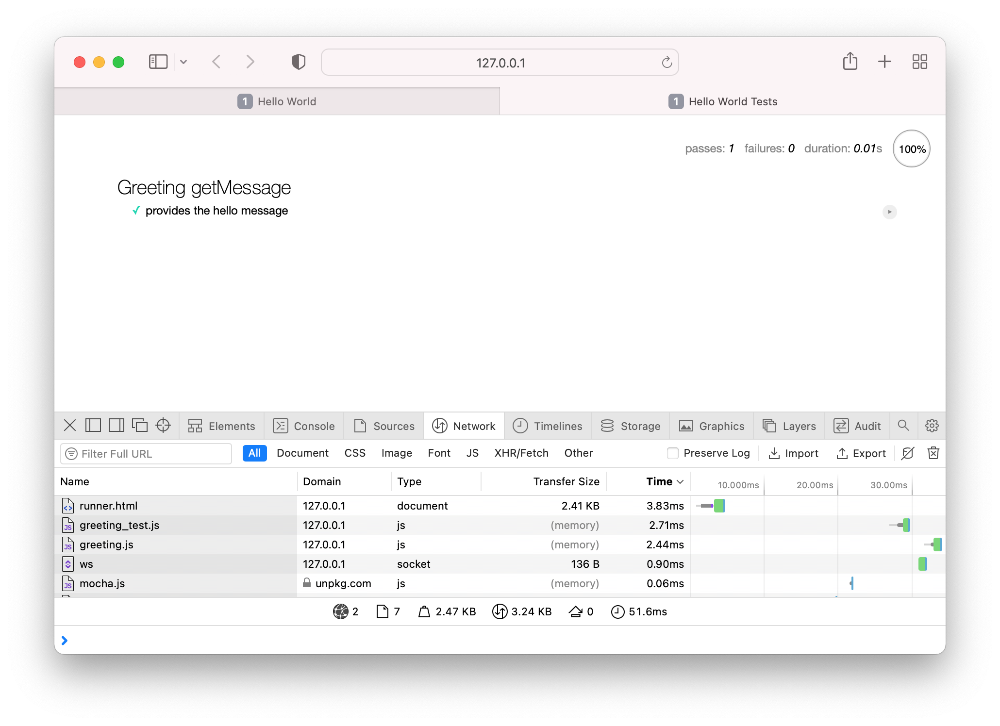
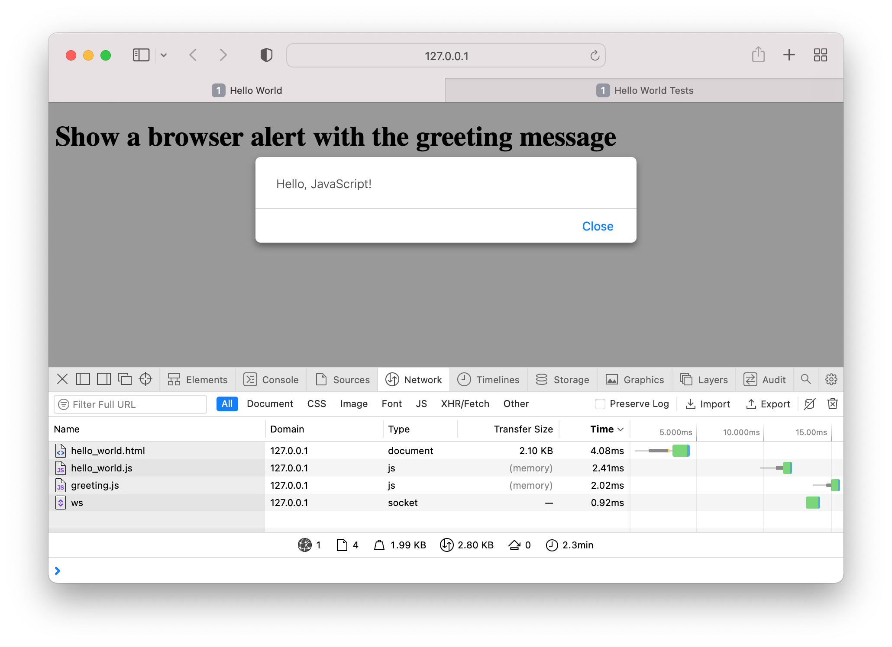

# Hello World

The typical starter application, written in JavaScript.

## Description

The first exercise is most basic, helping to discover the minimal configuration, described in the parent document.

While simple, the exercise is deliberately over-engineered to include a unit test of a class in a module -- essential concepts for further exercises.

## Tests

A Mocha unit test defines the greeting message -- open modules/test/runner.html with a server.

## Application

Open hello_world.html with a server.

